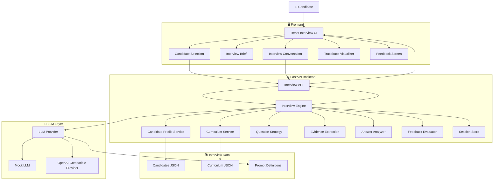
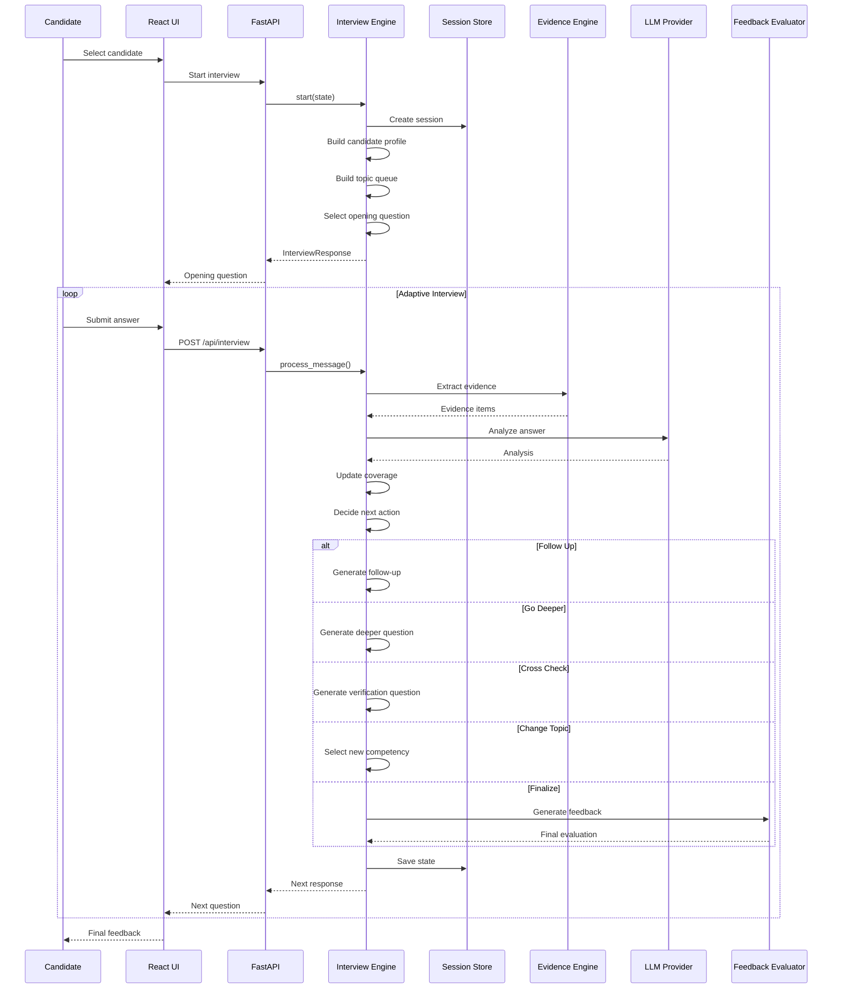
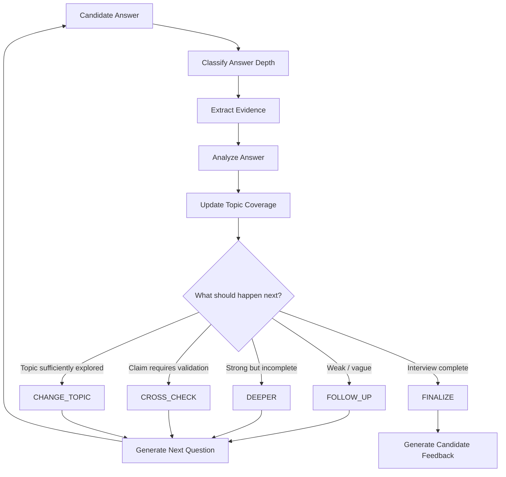
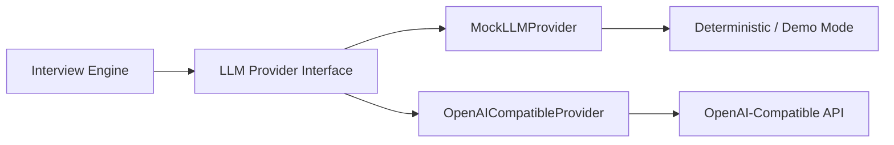
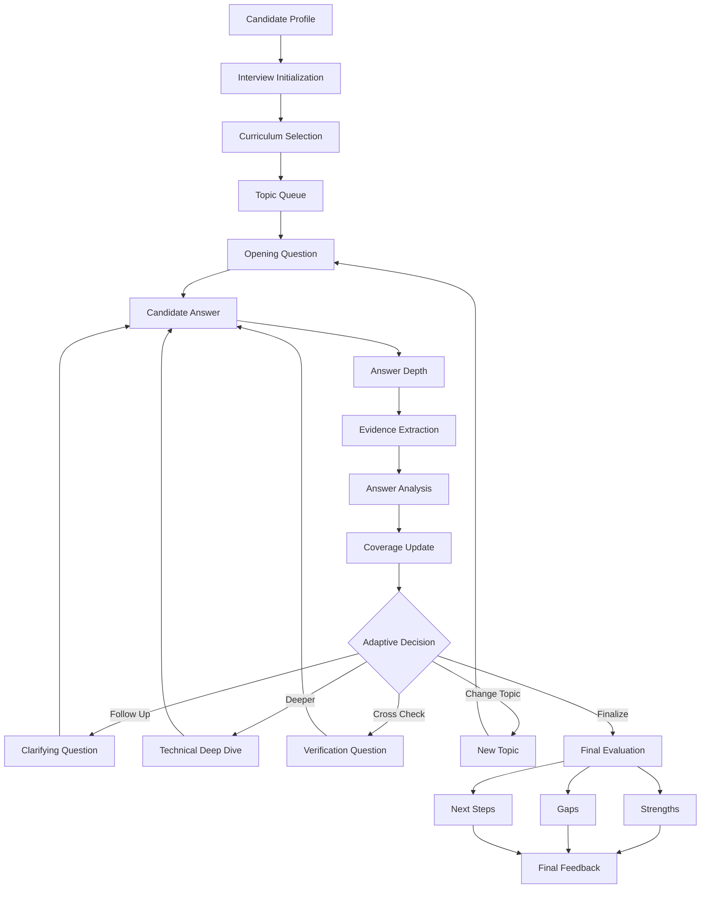

# Traceback Interview Agent

> **Don't just ask questions. Trace the reasoning behind the answer.**

Traceback Interview Agent is an adaptive AI technical-interview system designed to evaluate candidates through **evidence-driven, follow-up-based interviewing** rather than static question lists.

Instead of simply checking whether a candidate mentions the "right" technology, the system progressively probes their answers, looks for concrete evidence, identifies gaps and contradictions, cross-checks claims, and changes direction when a topic has been sufficiently explored.

The result is an interview experience that behaves more like a thoughtful technical interviewer than a conventional quiz.

---

## ✨ What Makes Traceback Different?

Traditional interview systems often follow a fixed sequence:

```text
Question 1
   ↓
Question 2
   ↓
Question 3
   ↓
Question 4
   ↓
Final Score
```

Traceback follows a different philosophy:

```text
Candidate Answer
       ↓
Evidence Extraction
       ↓
Answer Analysis
       ↓
Coverage Analysis
       ↓
Adaptive Decision
       ↓
┌──────────────────────────────────────┐
│ Follow Up │ Go Deeper │ Cross Check  │
│ Change Topic │ Finalize              │
└──────────────────────────────────────┘
       ↓
Next Question
       ↓
Repeat
```

The system continuously asks:

> **"What do we still need to know about this candidate's claim?"**

---

# 🧠 Core Concept

Traceback is built around four principles:

### 1. Evidence over keywords

A candidate saying:

> "I built a scalable FastAPI backend."

is not treated as sufficient evidence.

The interviewer can probe:

- What was the architecture?
- What made it scalable?
- What bottleneck did you encounter?
- How did you measure performance?
- What trade-off did you make?
- What would you change now?

The system therefore evaluates **depth and credibility**, not just vocabulary.

---

### 2. Adaptive interviewing

Questions are generated according to the candidate's previous answers.

A strong answer can trigger deeper technical questioning.

A vague answer can trigger clarification.

A suspicious claim can trigger a cross-check.

A sufficiently explored topic can be abandoned in favor of another competency.

---

### 3. Evidence-backed evaluation

The evaluator builds an internal evidence trail throughout the interview.

```text
Candidate Answer
      │
      ▼
┌─────────────────┐
│ Evidence Parser │
└────────┬────────┘
         │
         ▼
┌─────────────────┐
│ Evidence Items  │
│                 │
│ • Claim         │
│ • Detail        │
│ • Context       │
│ • Depth         │
│ • Confidence    │
└────────┬────────┘
         │
         ▼
┌─────────────────┐
│ Final Evaluator │
└─────────────────┘
```

This allows final feedback to be grounded in what the candidate actually demonstrated during the conversation.

---

### 4. Deterministic fallback

LLMs are useful, but the application should not completely collapse when an external model is unavailable.

Traceback therefore contains deterministic rule-based fallbacks for:

- answer analysis
- evidence extraction
- depth classification
- question generation
- feedback generation

This makes the project usable in local/demo environments without requiring a live LLM for every operation.

---

# 🏗️ System Architecture



---

# 🔄 End-to-End Interview Flow



---

# 🎯 Adaptive Decision Engine

The heart of Traceback is the `InterviewEngine`.

It does not blindly increment a question counter.

Instead, every candidate answer contributes information to the current interview state.



---

# 🧩 Interview Actions

The engine can choose between several actions.

| Action         | Purpose                                              |
| -------------- | ---------------------------------------------------- |
| `FOLLOW_UP`    | Clarify a vague or incomplete answer                 |
| `DEEPER`       | Explore a technically strong answer in greater depth |
| `CROSS_CHECK`  | Verify or challenge an important claim               |
| `CHANGE_TOPIC` | Move to another competency                           |
| `FINALIZE`     | End the interview and generate feedback              |

This allows the system to behave differently for different candidates.

---

# 🔬 Evidence Engine

The evidence system is one of the most important parts of the project.

Instead of treating an answer as plain text, Traceback attempts to identify meaningful evidence inside it.

Example:

```text
Candidate:

"I improved our API latency by adding Redis caching.
Before that, average response time was around 800ms.
After introducing caching it dropped to roughly 200ms."
```

The system can identify evidence such as:

```text
Claim:
Redis caching was introduced.

Context:
API performance problem.

Measurement:
800ms → 200ms.

Technical action:
Caching layer.

Impact:
~75% reduction in response latency.
```

---

# 📊 Answer Depth

Answers can be classified according to their depth.

The system considers signals such as:

- specificity
- technical detail
- concrete examples
- reasoning
- measurable outcomes
- implementation details
- trade-offs
- supporting evidence

Conceptually:

```text
                Answer Depth

                    ▲
                    │
              Deep / Strong
                    │
          ┌─────────┴─────────┐
          │                   │
       Detailed           Measurable
          │                   │
          └─────────┬─────────┘
                    │
                 Moderate
                    │
                 Generic
                    │
                  Weak
                    ▼
```

A shallow answer can therefore trigger another question instead of immediately being treated as a failure.

---

# 🧠 Question Strategy

The question strategy layer prevents the interview from becoming repetitive.

It considers:

- current topic
- previous questions
- previous answers
- explored dimensions
- extracted evidence
- answer quality
- follow-up count
- candidate profile
- remaining curriculum areas

The strategy can generate questions targeting dimensions such as:

```text
┌────────────────────────────┐
│ Technical Knowledge        │
├────────────────────────────┤
│ Implementation             │
│ Debugging                  │
│ Architecture               │
│ Trade-offs                 │
│ Performance                │
│ Failure Handling           │
│ Testing                    │
│ Security                   │
│ Decision Making             │
└────────────────────────────┘
```

---

# 👤 Candidate Profile

The candidate profile service provides context before the interview starts.

Candidate information can influence:

- starting topic
- difficulty
- curriculum selection
- question relevance
- expected depth
- final evaluation

The system can therefore distinguish between candidates rather than giving every candidate an identical interview.

---

# 📚 Curriculum-Driven Interviewing

The interview is connected to a curriculum rather than relying entirely on arbitrary question generation.

The curriculum defines the areas that the interview should cover.

Conceptually:

```text
Candidate Profile
       │
       ▼
Curriculum
       │
       ▼
Topic Queue
       │
       ├── Topic A
       ├── Topic B
       ├── Topic C
       ├── Topic D
       └── Topic E
             │
             ▼
       Adaptive Engine
             │
             ▼
       Interview Questions
```

This gives the interview structure while still allowing dynamic behavior.

---

# 🤖 LLM Architecture

Traceback uses an abstraction layer around the language model.



This separation prevents the core interview engine from becoming tightly coupled to a specific model provider.

---

# 📴 Offline / Mock Mode

The project includes a mock provider for local development.

This is useful when:

- no API key is available
- internet access is unavailable
- the project is being demonstrated
- deterministic behavior is preferred
- tests should not depend on external APIs

The architecture therefore supports:

```text
                    ┌───────────────┐
                    │ Interview App │
                    └───────┬───────┘
                            │
                    ┌───────▼───────┐
                    │ LLM Provider  │
                    └───────┬───────┘
                            │
                  ┌─────────┴─────────┐
                  │                   │
             Mock Mode           Live Mode
                  │                   │
                  ▼                   ▼
             Local Logic       External LLM
```

---

# 🗂️ Project Structure

```text
traceback/
│
├── backend/
│   ├── app/
│   │   ├── api/
│   │   │   └── interview.py
│   │   │
│   │   ├── interview/
│   │   │   ├── engine.py
│   │   │   ├── evaluator.py
│   │   │   ├── evidence.py
│   │   │   └── question_strategy.py
│   │   │
│   │   ├── llm/
│   │   │   └── provider.py
│   │   │
│   │   ├── models/
│   │   │   └── schemas.py
│   │   │
│   │   ├── services/
│   │   │   ├── candidate_profile.py
│   │   │   └── curriculum.py
│   │   │
│   │   ├── storage/
│   │   │   └── session_store.py
│   │   │
│   │   ├── config.py
│   │   └── main.py
│   │
│   ├── tests/
│   │   ├── test_evidence.py
│   │   └── test_interview_api.py
│   │
│   ├── pytest.ini
│   └── requirements.txt
│
├── frontend/
│   ├── src/
│   │   ├── components/
│   │   │   ├── CandidateSelect.jsx
│   │   │   ├── FeedbackScreen.jsx
│   │   │   ├── InterviewBrief.jsx
│   │   │   ├── InterviewLayout.jsx
│   │   │   └── TracebackVisualizer.jsx
│   │   │
│   │   ├── App.jsx
│   │   ├── index.css
│   │   └── main.jsx
│   │
│   ├── index.html
│   ├── package.json
│   └── vite.config.js
│
├── organizer/
│   ├── candidates.json
│   ├── curriculum (1).json
│   └── technical-spec.md
│
├── PROMPTS.md
├── README.md
├── .env.example
└── .gitignore
```

---

# 🎨 Frontend Experience

The frontend is designed around the interview journey rather than a generic admin dashboard.

## Candidate Selection

The candidate chooses their interview profile before entering the session.

```text
┌──────────────────────────────────────────────┐
│              TRACEBACK                       │
│       Adaptive Technical Interview           │
│                                              │
│  Select Candidate                            │
│                                              │
│  ┌────────────────────────────────────────┐  │
│  │ Candidate Profile                      │  │
│  │                                        │  │
│  │ Experience                             │  │
│  │ Skills                                 │  │
│  │ Target Role                            │  │
│  └────────────────────────────────────────┘  │
│                                              │
│             [ Start Interview ]              │
└──────────────────────────────────────────────┘
```

---

## Interview Interface

The interview screen presents:

- current question
- candidate response area
- interview progress
- current topic
- evidence / reasoning context
- traceback visualization
- session controls

The goal is to make the interview feel like an active reasoning process rather than a form.

---

# 🔎 Traceback Visualization

The `TracebackVisualizer` communicates how the system is reasoning about the interview.

Conceptually:

```text
QUESTION
   │
   ▼
ANSWER
   │
   ▼
EVIDENCE
   │
   ▼
ANALYSIS
   │
   ▼
DECISION
   │
   ▼
NEXT QUESTION
```

This is useful for demonstrating the core differentiator of the project:

> The system does not merely collect answers — it traces how answers affect the next decision.

---

# 📈 Interview Progress

Progress is tracked internally through the interview state.

The state includes information such as:

- current question
- target question count
- interview stage
- explored areas
- current topic
- evidence
- answer history
- next action
- candidate context

This enables the frontend to present meaningful progress rather than simply displaying a question number.

---

# 🏁 Final Evaluation

Once the engine determines that the interview is complete, the evaluator generates structured feedback.

The feedback can include:

### Summary

A concise description of the candidate's overall performance.

### Strengths

Areas where the candidate demonstrated strong understanding or evidence.

### Gaps

Areas where the candidate lacked depth, clarity, or supporting evidence.

### Next Steps

Recommended areas for improvement or preparation.

Conceptually:

```text
              FINAL INTERVIEW
                     │
                     ▼
              Evidence Store
                     │
                     ▼
             Answer Analysis
                     │
                     ▼
              ┌──────────────┐
              │  Evaluator   │
              └──────┬───────┘
                     │
        ┌────────────┼────────────┐
        ▼            ▼            ▼
     Strengths      Gaps       Next Steps
```

---

# 🔌 API

The backend is powered by FastAPI.

## Health Check

```http
GET /health
```

Used to verify that the backend is running.

---

## Candidates

```http
GET /api/candidates
```

Returns available candidate profiles.

---

## Curriculum

```http
GET /api/curriculum
```

Returns the configured interview curriculum.

---

## Interview

```http
POST /api/interview
```

This is the primary interview endpoint.

It supports both:

### Starting an interview

```json
{
  "candidate": "candidate-id"
}
```

### Continuing an interview

```json
{
  "session_id": "session-id",
  "message": "The candidate's answer..."
}
```

The exact request/response structure is defined in:

```text
backend/app/models/schemas.py
```

---

# 🔐 Session Management

Sessions are currently stored using an in-memory thread-safe session store.

```text
Client
  │
  ▼
FastAPI
  │
  ▼
Session ID
  │
  ▼
In-Memory Session Store
  │
  ├── Candidate
  ├── Questions
  ├── Answers
  ├── Evidence
  ├── Coverage
  ├── Progress
  └── Interview Stage
```

### Important

The current implementation is intended for development/demo usage.

Sessions are not a persistent production database.

Restarting the backend can therefore clear active sessions.

---

# ⚙️ Configuration

Environment configuration is documented through:

```text
.env.example
```

Typical configuration controls:

- LLM provider
- API configuration
- CORS
- question limits
- message limits
- mock/fallback behavior

Create a local environment file:

```powershell
Copy-Item .env.example .env
```

Then update the values required for your environment.

---

# 🚀 Local Development

## Requirements

Recommended environment:

- Python 3.10+
- Node.js 18+
- npm
- Git

---

# 🐍 Backend Setup

From the repository root:

```powershell
cd backend
```

Create a virtual environment:

```powershell
python -m venv .venv
```

Activate it on Windows:

```powershell
.\.venv\Scripts\Activate.ps1
```

Install dependencies:

```powershell
pip install -r requirements.txt
```

Run the backend:

```powershell
uvicorn app.main:app --reload --port 8000
```

Backend:

```text
http://localhost:8000
```

API documentation:

```text
http://localhost:8000/docs
```

---

# ⚛️ Frontend Setup

Open another terminal:

```powershell
cd frontend
```

Install dependencies:

```powershell
npm install
```

Start the development server:

```powershell
npm run dev
```

The terminal will display the local frontend URL.

---

# 🧪 Testing

Backend tests are located in:

```text
backend/tests/
```

Run:

```powershell
cd backend
pytest -q
```

The test suite covers important behavior around:

- evidence extraction
- interview API behavior
- interview state transitions
- adaptive interview behavior

A healthy repository should report all tests passing.

---

# 🏗️ Production Build

Build the frontend:

```powershell
cd frontend
npm run build
```

The Vite production output is generated under:

```text
frontend/dist/
```

The FastAPI application is also structured to serve the frontend build when it is available.

---

# 🧪 Development Verification Checklist

Before committing changes:

```powershell
git diff --check
```

Then:

```powershell
cd backend
pytest -q
```

Then:

```powershell
cd ..\frontend
npm run build
```

Finally:

```powershell
cd ..
git status
```

Recommended final state:

```text
git diff --check
        ↓
No whitespace errors

pytest -q
        ↓
All backend tests passing

npm run build
        ↓
Frontend production build succeeds

git status
        ↓
Review every modified/untracked file
```

---

# 🧱 Design Principles

## Separation of concerns

The project separates:

```text
API
 │
 ├── Interview Engine
 │
 ├── Evidence System
 │
 ├── Question Strategy
 │
 ├── Evaluator
 │
 ├── Candidate Profile
 │
 ├── Curriculum
 │
 ├── LLM Provider
 │
 └── Session Store
```

Each layer has a focused responsibility.

---

## LLM abstraction

The interview engine does not need to know which model is being used.

Instead:

```text
Interview Engine
       │
       ▼
LLM Provider
       │
   ┌───┴────┐
   ▼        ▼
 Mock     External
```

This makes experimentation with different providers easier.

---

## Graceful degradation

The system should remain useful even when the LLM is unavailable.

```text
LLM Available?
      │
 ┌────┴────┐
 │         │
YES       NO
 │         │
 ▼         ▼
LLM      Rules
 │         │
 └────┬────┘
      ▼
Interview Result
```

---

# 🛡️ Reliability Strategy

Traceback uses multiple layers of protection against bad interview behavior.

### Repetition control

The engine tracks explored dimensions and previous questions to reduce repetitive questioning.

### Follow-up limits

Follow-ups are bounded so that the interview does not remain indefinitely on one topic.

### Topic changes

When a competency has been sufficiently explored, the system can move to another topic.

### Finalization

The engine can terminate the interview when enough evidence has been collected or the configured interview limits are reached.

---

# 📦 Technology Stack

| Layer              | Technology                |
| ------------------ | ------------------------- |
| Frontend           | React                     |
| Build Tool         | Vite                      |
| Backend            | FastAPI                   |
| Language           | Python                    |
| Validation         | Pydantic                  |
| Testing            | Pytest                    |
| AI                 | Configurable LLM provider |
| Local fallback     | Mock/rule-based logic     |
| Session storage    | In-memory store           |
| Curriculum         | JSON                      |
| Candidate profiles | JSON                      |

---

# 🔬 Technical Module Responsibilities

## `backend/app/main.py`

Application entry point.

Responsibilities include:

- creating the FastAPI application
- configuring middleware
- registering routes
- health endpoint
- candidate endpoint
- curriculum endpoint
- frontend serving

---

## `backend/app/api/interview.py`

HTTP interface for the interview system.

Responsible for:

- validating requests
- starting sessions
- continuing sessions
- validating session state
- returning interview responses

---

## `backend/app/interview/engine.py`

The central orchestration layer.

Responsible for:

- initializing interviews
- building candidate context
- selecting topics
- processing answers
- extracting evidence
- analyzing answers
- choosing next actions
- generating questions
- tracking progress
- completing interviews

---

## `backend/app/interview/evidence.py`

Evidence extraction and answer analysis.

Responsible for:

- answer depth classification
- evidence extraction
- rule-based analysis
- LLM-backed analysis
- fallback analysis

---

## `backend/app/interview/question_strategy.py`

Adaptive question selection.

Responsible for determining:

- what should be asked
- whether a follow-up is needed
- whether deeper probing is appropriate
- whether a claim should be cross-checked
- when to change topics

---

## `backend/app/interview/evaluator.py`

Final evaluation and feedback.

Responsible for:

- summarizing the interview
- identifying strengths
- identifying gaps
- recommending next steps
- using LLM or deterministic fallback logic

---

## `backend/app/llm/provider.py`

LLM abstraction.

Contains provider implementations such as:

```text
MockLLMProvider
OpenAICompatibleProvider
```

---

## `backend/app/models/schemas.py`

Defines the structured application models.

Examples include:

- interview request
- interview response
- interview state
- evidence item
- interview stage
- next action
- coverage dimensions

---

## `backend/app/storage/session_store.py`

Thread-safe in-memory session management.

---

# 🗺️ Complete Data Flow



---

# 🧭 Example Interview

Suppose the candidate claims:

> "I built a recommendation system using Python and Redis."

Traceback may proceed like this:

### Question 1

```text
Tell me about the recommendation system you built.
```

Candidate gives a vague answer.

### Decision

```text
FOLLOW_UP
```

### Question 2

```text
What signals did your system use to generate recommendations?
```

Candidate explains collaborative filtering.

### Decision

```text
DEEPER
```

### Question 3

```text
How did you handle the cold-start problem?
```

Candidate claims a specific solution.

### Decision

```text
CROSS_CHECK
```

### Question 4

```text
What happened when you evaluated that approach in production?
```

Now the engine has a much richer evidence trail.

---

# 🏆 Why This Architecture Matters

The most important difference is not that Traceback uses an LLM.

Many interview products use LLMs.

The important distinction is **how the LLM is used**.

Instead of:

```text
Resume
  ↓
Generate 10 Questions
  ↓
Ask Questions
  ↓
Generate Summary
```

Traceback aims for:

```text
Candidate Context
      ↓
Competency Model
      ↓
Question
      ↓
Answer
      ↓
Evidence
      ↓
Analysis
      ↓
Decision
      ↓
Adaptive Question
      ↓
More Evidence
      ↓
Final Evaluation
```

The interview therefore becomes an **evidence acquisition process**.

---

# 🚧 Current Limitations

The current implementation is intentionally focused on demonstrating the adaptive interview architecture.

Known limitations include:

### In-memory sessions

Sessions currently use an in-memory store and are not designed for multi-instance production deployment.

### JSON-based data

Candidate and curriculum data are currently file-based rather than backed by a production database.

### LLM dependency

Live LLM quality depends on the configured provider and model.

### Deterministic fallback

The fallback system provides reliability but is naturally less capable than a strong language model for nuanced reasoning.

### Production authentication

The current project does not attempt to provide a complete enterprise identity/access-control system.

### Observability

Production-grade distributed tracing, metrics, and centralized logging are future improvements.

---

# 🔮 Future Roadmap

Potential production improvements include:

- PostgreSQL session persistence
- Redis-backed session state
- authentication and role-based access
- recruiter dashboard
- candidate comparison
- interviewer analytics
- richer competency graphs
- interview replay
- evidence timeline
- confidence calibration
- model evaluation benchmarks
- structured scoring rubrics
- multi-model arbitration
- production observability
- Docker deployment
- CI/CD
- cloud deployment
- rate limiting
- audit logging
- persistent interview history

---

# 🔐 Security Considerations

For production deployment, additional controls should be added around:

- authentication
- authorization
- API rate limiting
- input validation
- prompt injection resistance
- secret management
- candidate data protection
- logging of sensitive information
- CORS restrictions
- session isolation
- external LLM data handling

API keys and secrets should **never** be committed to Git.

Use environment variables or a dedicated secret-management solution.

---

# 🤝 Development Workflow

A recommended workflow is:

```text
1. Pull latest changes
       ↓
2. Create a feature branch
       ↓
3. Make a focused change
       ↓
4. Run tests
       ↓
5. Build frontend
       ↓
6. Run git diff --check
       ↓
7. Review git diff
       ↓
8. Commit
       ↓
9. Push
       ↓
10. Open PR
```

Before committing:

```powershell
git diff --check
```

```powershell
cd backend
pytest -q
```

```powershell
cd ..\frontend
npm run build
```

---

# 📜 Repository Documentation

Additional project documentation:

| File                            | Purpose                            |
| ------------------------------- | ---------------------------------- |
| `README.md`                     | Project overview and setup         |
| `PROMPTS.md`                    | Prompt design and LLM instructions |
| `organizer/technical-spec.md`   | Technical specification            |
| `organizer/candidates.json`     | Candidate profiles                 |
| `organizer/curriculum (1).json` | Interview curriculum               |
| `.env.example`                  | Environment configuration template |

---

# 🎯 Project Vision

Traceback is designed around a simple idea:

> **A good technical interview should not stop at the first answer.**

A candidate's first response is only the beginning.

The interviewer should determine:

```text
What did they claim?
       ↓
What evidence supports it?
       ↓
How deep is their understanding?
       ↓
Can they explain implementation details?
       ↓
Can they reason about trade-offs?
       ↓
Can they defend the decision?
       ↓
Can they handle edge cases?
       ↓
What remains unknown?
```

That is the purpose of Traceback.

---

## ⭐ The Core Loop

```text
┌─────────────────────────────────────┐
│                                     │
│          ASK A QUESTION             │
│                │                    │
│                ▼                    │
│          RECEIVE ANSWER             │
│                │                    │
│                ▼                    │
│        EXTRACT EVIDENCE              │
│                │                    │
│                ▼                    │
│        ANALYZE THE ANSWER            │
│                │                    │
│                ▼                    │
│       IDENTIFY WHAT'S MISSING       │
│                │                    │
│                ▼                    │
│        CHOOSE NEXT ACTION            │
│                │                    │
│       ┌────────┼────────┐           │
│       ▼        ▼        ▼           │
│    FOLLOW    DEEPER   CROSS-CHECK   │
│       │        │        │           │
│       └────────┼────────┘           │
│                ▼                    │
│          ASK NEXT QUESTION          │
│                │                    │
│                └───────────────┐    │
│                                │    │
│             UNTIL ENOUGH       │    │
│             EVIDENCE EXISTS    │    │
│                                ▼    │
│                       FINAL EVALUATION│
│                                     │
└─────────────────────────────────────┘
```

---

# 🚀 Traceback

**Adaptive interviews.
Evidence-driven evaluation.
Reasoning instead of keyword matching.**

> **Don't just ask what they know. Trace how they know it.**

<p align="center"> <strong>Traceback Interview Agent</strong><br/> Adaptive interviews • Evidence-driven evaluation • Technical reasoning </p> <p align="center"> Built with ❤️ for the ABTalks problem-solving initiative. </p> ```
