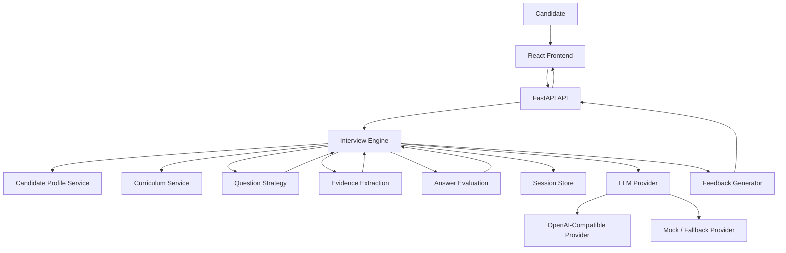

# TRACEBACK

**TRACEBACK is an evidence-driven AI interview agent prototype.**

This repository pairs a FastAPI backend with a React + Vite frontend to simulate technical interview sessions that probe candidate reasoning, extract evidence from answers, and generate structured feedback.

## What TRACEBACK Does

- Starts and continues interview sessions using a `sessionId`
- Loads candidate profiles and curriculum data from `organizer/`
- Generates adaptive questions based on answer quality and topic coverage
- Extracts evidence using rule-based heuristics with optional LLM analysis
- Decides whether to ask follow-ups, deeper probes, claim validation, or next-topic questions
- Produces end-of-interview feedback with strengths, gaps, and next steps
- Supports an offline demo mode when backend connectivity fails

## Why This Project Is Different

TRACEBACK is designed as an interviewer, not a chatbot. It focuses on:

- examining candidate claims rather than conversational chit-chat
- probing surface-level responses with evidence-based follow-up questions
- adapting question difficulty and topic coverage based on performance

## Repository Layout

- `backend/` — FastAPI backend, interview engine, session store, and LLM provider abstraction
- `frontend/` — React + Vite UI for candidate selection, interview flow, and feedback
- `organizer/` — candidate metadata, curriculum payload, and technical spec source material
- `.env.example` — runtime configuration template
- `README.md` — documentation for setup, architecture, and API usage

## Architecture



### Backend

The backend is centered on a lightweight interview engine:

- `backend/app/main.py` — FastAPI app, CORS middleware, health check, candidate/curriculum endpoints, optional frontend static mount
- `backend/app/api/interview.py` — interview endpoint for session start and message continuation
- `backend/app/interview/engine.py` — interview lifecycle, state transitions, action decisions, and completion logic
- `backend/app/interview/question_strategy.py` — question bank, topic queue, claim probes, and optional LLM question generation
- `backend/app/interview/evidence.py` — answer evidence extraction, depth classification, and answer analysis
- `backend/app/interview/evaluator.py` — summary feedback generation
- `backend/app/llm/provider.py` — mock provider and OpenAI-compatible provider abstraction
- `backend/app/services/candidate_profile.py` — candidate context analysis for strengths, weak areas, and skipped concepts
- `backend/app/services/curriculum.py` — loads curriculum and candidate JSON files
- `backend/app/storage/session_store.py` — thread-safe in-memory state persistence

### Frontend

The frontend provides:

- candidate selection and profile overview
- interview brief screen before starting the session
- chat-style interview flow with adaptive progress indicators
- final feedback screen with competency coverage, strengths, gaps, and next steps
- offline demo fallback when the backend is unreachable

## Interview Flow

1. Frontend loads candidate metadata from `GET /api/candidates`
2. User selects a candidate and sends `sessionId` + `candidate` to `POST /api/interview`
3. Backend initializes the interview state and returns the first question
4. Candidate answers are sent as `sessionId` + `message` to `POST /api/interview`
5. Backend extracts evidence, analyzes answer quality, and decides the next action
6. Endpoint returns a question or completes the interview with structured feedback

## API Reference

### `POST /api/interview`

Start or continue an interview session.

#### Start request

```json
{
  "sessionId": "abc-123",
  "candidate": {
    "member": {
      "id": "CAND-001",
      "name": "Sarah Johnson",
      "jobRole": "Senior Data Engineer",
      "yearsExperience": 9,
      "education": "MS Computer Science",
      "status": "COMPLETED"
    },
    "missions": [],
    "signals": {}
  }
}
```

#### Continue request

```json
{
  "sessionId": "abc-123",
  "message": "Your answer text here."
}
```

Rules:

- Start requests must include `candidate` and must not include `message`
- Continue requests must include `message`
- `sessionId` is required and identifies the interview session

#### Example response

```json
{
  "reply": "Follow-up question text",
  "done": false,
  "progress": {
    "questionNumber": 3,
    "totalQuestions": 10,
    "stage": "FOLLOW_UP",
    "areasExplored": [
      { "name": "Fundamentals", "explored": true },
      { "name": "Implementation", "explored": true }
    ]
  }
}
```

#### Completion response

```json
{
  "reply": "Interview completed.",
  "done": true,
  "feedback": {
    "summary": "...",
    "strengths": ["..."],
    "gaps": ["..."],
    "next": ["..."]
  },
  "progress": {
    "stage": "COMPLETED"
  }
}
```

### `GET /api/candidates`

Returns candidate metadata for selection. The backend intentionally strips internal fields such as `member.status` from the payload.

### `GET /api/curriculum`

Returns the curriculum JSON payload loaded from `organizer/`.

### `GET /health`

Returns a basic health check.

## Environment Configuration

The backend reads `.env` via `pydantic-settings`.

| Variable             | Default                                       | Description                                          |
| -------------------- | --------------------------------------------- | ---------------------------------------------------- |
| `LLM_PROVIDER`       | `mock`                                        | Supported values: `mock`, `openai`, `groq`, `ollama` |
| `LLM_MODEL`          | `gpt-4o-mini`                                 | Model name for OpenAI-compatible provider            |
| `LLM_API_KEY`        | (empty)                                       | API key for real LLM access                          |
| `LLM_BASE_URL`       | (empty)                                       | Optional OpenAI-compatible API base URL              |
| `MOCK_LLM`           | `true`                                        | Force mock mode regardless of provider settings      |
| `TARGET_QUESTIONS`   | `10`                                          | Maximum interview turns before completion            |
| `MAX_MESSAGE_LENGTH` | `4000`                                        | Maximum allowed candidate answer length              |
| `HOST`               | `0.0.0.0`                                     | Backend listening host                               |
| `PORT`               | `8000`                                        | Backend listening port                               |
| `CORS_ORIGINS`       | `http://localhost:5173,http://localhost:3000` | Allowed frontend origins                             |

## Running Locally

### Backend

```bash
cd backend
python -m venv .venv
```

Windows:

```powershell
.venv\Scripts\activate
```

macOS / Linux:

```bash
source .venv/bin/activate
```

Install dependencies:

```bash
pip install -r requirements.txt
```

Create `.env` from the example:

```powershell
copy ..\.env.example ..\.env
```

or

```bash
cp ../.env.example ../.env
```

Start the backend:

```bash
uvicorn app.main:app --reload --port 8000
```

### Frontend

```bash
cd frontend
npm install
npm run dev
```

Open `http://localhost:5173`.

## Real LLM Mode

To enable real LLM-powered analysis, set:

```text
LLM_PROVIDER=openai
LLM_MODEL=<model-name>
LLM_API_KEY=<your-api-key>
```

Optionally set `LLM_BASE_URL` for a custom OpenAI-compatible endpoint.

## Mock / Demo Mode

- `MOCK_LLM=true` forces the backend to use the built-in mock provider.
- The frontend also falls back to a clearly labeled offline demo mode if the backend is unreachable.
- Offline demo mode uses scripted questions and feedback; it does not claim real scoring.

## Testing

```bash
cd backend
pytest -v
```

## Demo Flow

1. Open TRACEBACK in the browser.
2. Select a candidate.
3. Review the interview brief.
4. Start the interview.
5. Answer the technical question.
6. TRACEBACK analyzes the response and probes claims.
7. Continue until completion.
8. Review strengths, gaps, and next steps.

## Limitations

- Session state is stored in memory and is lost on backend restart
- There is no authentication or authorization layer
- There is no persistent database
- Mock/demo mode is intended for development and demos, not production
- Frontend error handling is basic and designed for prototype use
